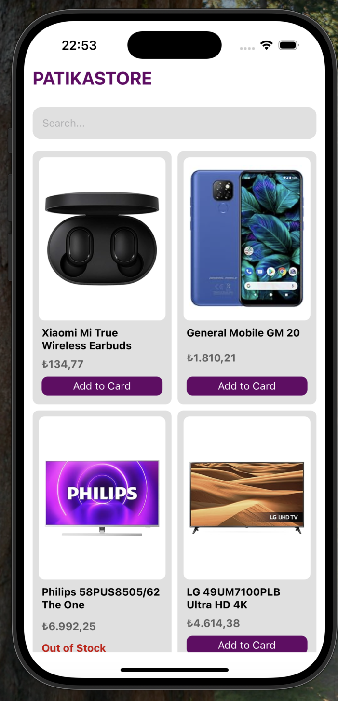
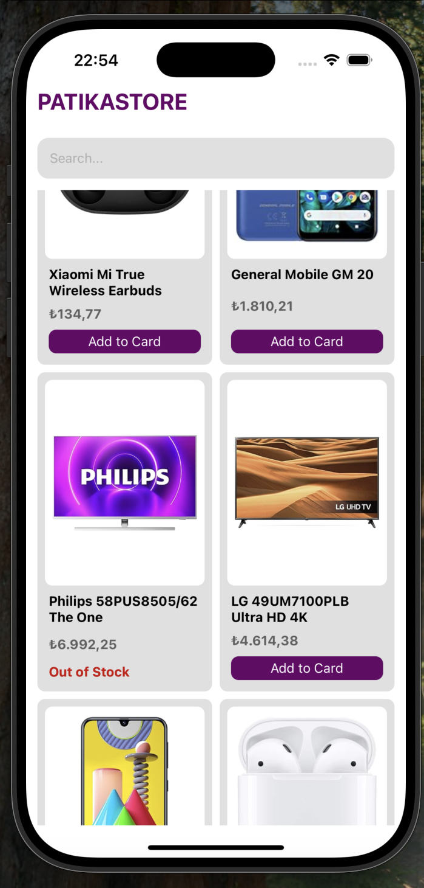
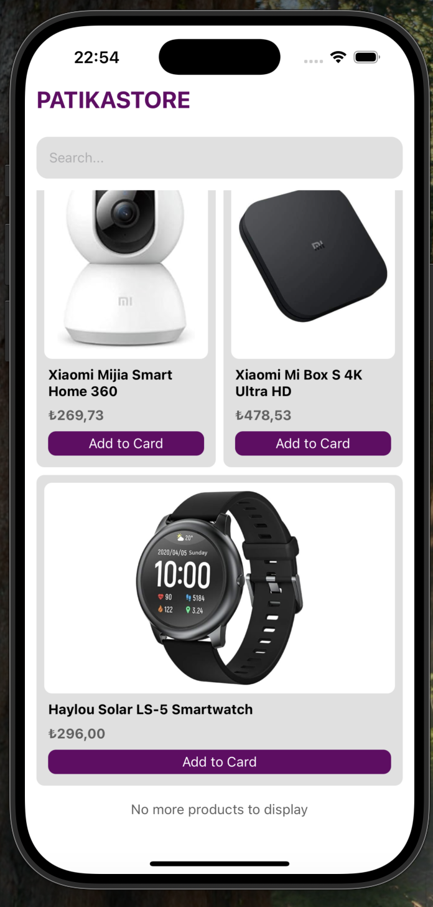

# 📱 PatikaStore

Bu proje, React Native öğrenme sürecimin ilk aşaması olarak geliştirilmiştir. Temel bileşenleri ve layout sistemini anlamak amacıyla başlık, arama çubuğu ve ürünleri listeleyen bir mobil uygulama tasarladım.

## 🚀 Kullanılan Teknolojiler

- Flexbox (Layout Sistemi)
- Custom Components
- StyleSheet API

## 📌 Üzerinde Durulan Konular

### 📷 Temel Bileşenler

- Image → Ürün görsellerini göstermek için kullanıldı.
- View → Genel kapsayıcı konteynerler için kullanıldı.
- Text → Başlık ve ürün detaylarını göstermek için kullanıldı.
- SafeAreaView → Çentiği olan telefonlarda güvenli alan yönetimi için kullanıldı.
- TextInput → (Henüz işlevsel değil) Arama çubuğu için eklendi.
- FlatList → Ürünleri listelemek için kullanıldı.

### 🎨 Layout & Style

- Flexbox ile düzenlemeler yaparak öğelerin yerleşimini sağladım.
- StyleSheet API kullanarak bileşenleri özelleştirdim.

### 🎛 Custom Components

- ProductCard adlı özel bir bileşen oluşturarak her ürünü bir kart şeklinde gösterdim.
- CustomButton bileşeni ile dokunulabilir bir buton oluşturdum.

### 📏 Diğer Kullanılan Özellikler

- numColumns → FlatList içinde ürünleri iki sütun halinde göstermek için kullanıldı.
- columnWrapperStyle → Sütunlar arasındaki boşlukları ayarlamak için kullanıldı.
- keyExtractor → FlatList içinde her ürünün benzersiz bir id değeri ile render edilmesini sağladım.
- ListFooterComponent → Listenin en altına ekstra bir bileşen ekleyerek içerik tamamlandığında daha iyi bir görünüm sağladım.
- contentContainerStyle → Listeye dış boşluk (padding) eklemek için kullanıldı.
- TouchableOpacity & onPress → Kullanıcı etkileşimini sağlamak için butonları dokunulabilir hale getirdim.
- Dimensions API → Cihaz genişliğini alarak dinamik tasarımlar oluşturmak için kullanıldı.

##### 📷 Ekran Görüntüsü

