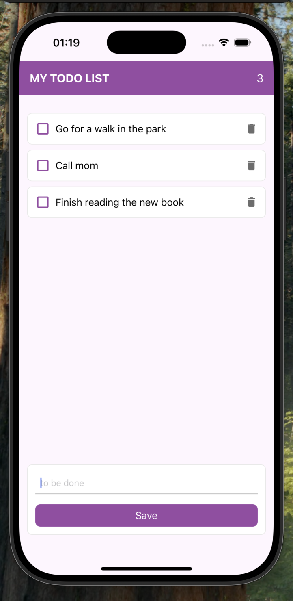

# ✏️ ToDo App

Bu proje, React Native öğrenme sürecimin ikinci aşaması olarak geliştirilmiştir. Temel olarak, kullanıcıların yapılacak işler listesini oluşturabileceği, öğeleri ekleyip silebileceği ve her öğe için durum değiştirebileceği bir Todo uygulaması tasarlandı. Bu uygulamada, React Native state yönetimi, lifecycle özellikleri, Context API kullanımı ve Express.js ile backend entegrasyonu gibi konuları uygulamalı olarak öğrendim.

## 🚀 Kullanılan Teknolojiler

- React Native → Uygulamanın frontend kısmı için kullanıldı.
- Express.js →  Backend kısmında görevlerin yönetilmesi için kullanıldı.
- Fetch API → Backend ile veri iletişimi sağlamak için kullanıldı.
- Context API → Uygulama genelinde state yönetimi ve fetch işlemlerini merkezi bir şekilde yönetmek için kullanıldı.
- State Management & Lifecycle → useState, useEffect gibi özellikleri kullanıldı.
- TextInput & TouchableOpacity → Kullanıcı etkileşimlerini sağlamak için kullanıldı.
- Platform → Uygulamanın farklı platformlarda düzgün çalışmasını sağlamak için platform özellikleri kullanıldı.

## 📌 Üzerinde Durulan Konular

### State Yönetimi (Context API)

- Context API kullanarak uygulama genelinde state yönetimini merkezi bir şekilde yaptım.
- Context API, uygulama bileşenleri arasında global state paylaşımını sağladı
- Görevlerin eklenmesi, silinmesi, güncellenmesi gibi işlemleri context üzerinden yönetilerek, her bileşende state güncellemeleri kolayca yapıldı.

### Lifecycle Yönetimi

- React Native'de uygulamanın yaşam döngüsünü yönetmek için useEffect kullanarak, API'den veri çekme ve bileşenler arası etkileşimi yönetmeyi öğrendim.

### Backend ve API Entegrasyonu
- Express.js kullanarak backend API'si geliştirdim. Bu API, uygulamaya yapılacaklar öğelerini eklemek, silmek, güncellemek ve listelemek gibi CRUD işlemleri sundu.
- Fetch API kullanarak, frontend React Native uygulamamdan backend API'sine veri gönderdim ve aldım. Backend'den veri çekme ve veri gönderme işlemleri sırasında fetch API kullandım.

### 📏 Diğer Kullanılan Özellikler

- TextInput → Kullanıcının yeni yapılacak öğeleri girmesi için TextInput bileşeni kullanıldı.
- TouchableOpacity & onPress → Kullanıcı etkileşimini sağlamak için butonları dokunulabilir hale getirdim.
- onChangeText → TextInput bileşeninde kullanıcının girdiği metni takip etmek ve dinamik olarak state güncellemeleri yapmak için kullanıldı.
- Platform → Uygulamanın Android ve iOS platformlarında farklı davranışlar sergilemesini sağlamak için platform spesifik özellikler kullanıldı.
-FlatList → Yapılacaklar listesinde öğeleri verimli bir şekilde listelemek için FlatList kullanıldı.

##### 📷 Ekran Görüntüsü

https://github.com/user-attachments/assets/e7613441-5c4d-4c70-acc5-33413d87842e

