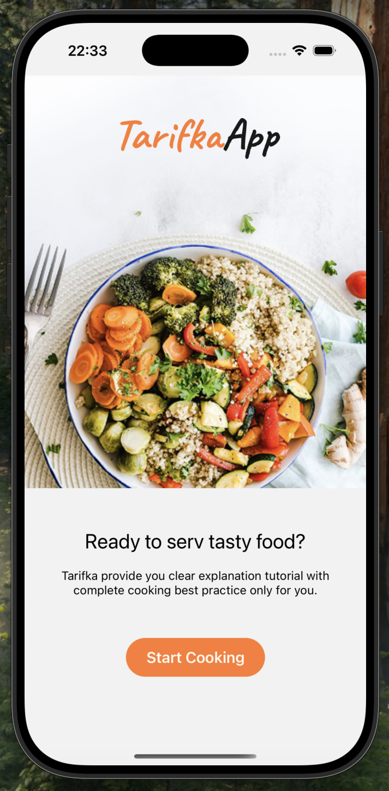
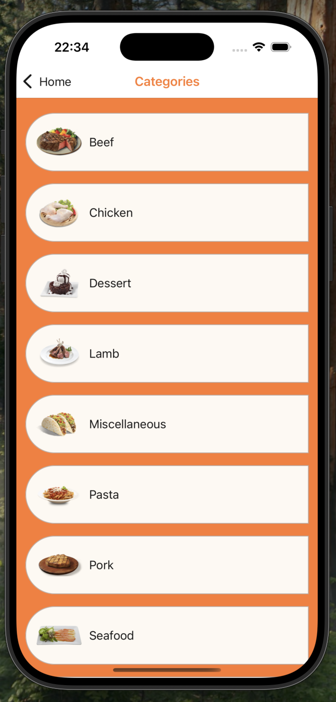
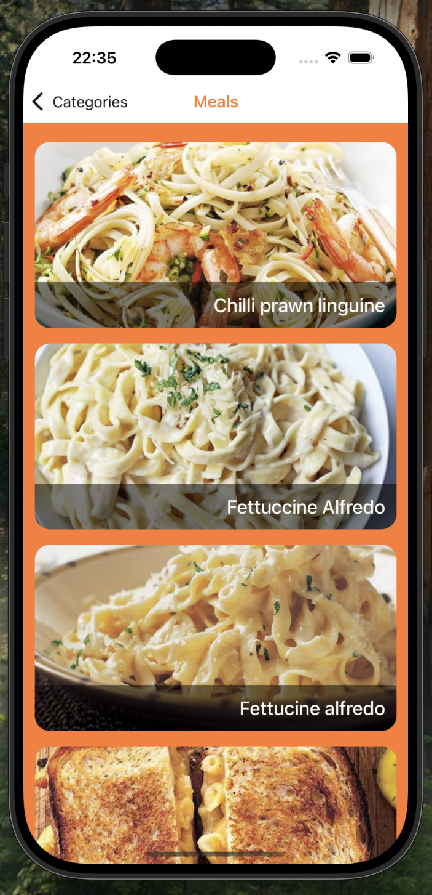
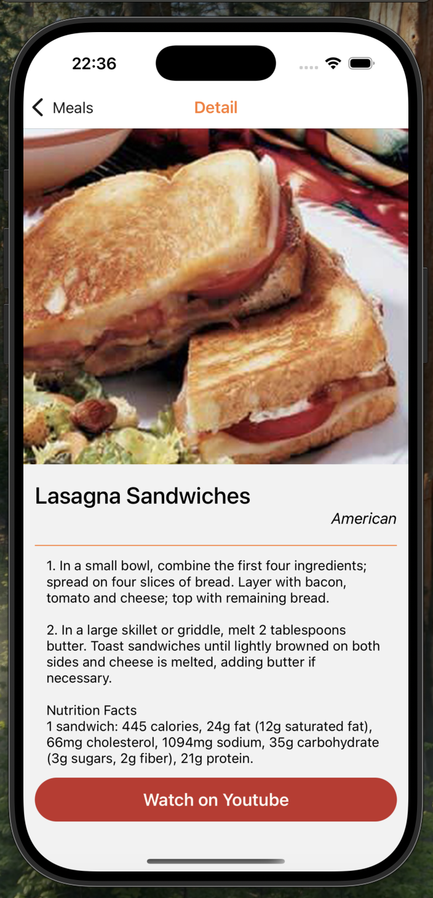

# 📌 TarifkaApp

Bu proje, React Native öğrenme sürecimin üçüncü aşaması olarak geliştirilmiştir. TarifkaApp, kullanıcıların tarifleri keşfedebileceği, tarif detaylarına ulaşabileceği ve youtube üzerinden ilgili tarifin videolarına erişebileceği bir mobil uygulamadır. Bu aşamada, Expo Router, API entegrasyonu, custom hook'lar ve asenkron veri yönetimi gibi konulara odaklanıldı.

## 🚀 Kullanılan Teknolojiler

React Native → Uygulamanın frontend kısmı için kullanıldı.

Expo Router → Stack yapısı ile sayfa yönlendirmeleri ve gezinme işlemleri için kullanıldı.

Axios → API ile veri alışverişi yapmak için kullanıldı.

Custom Hook → API çağrılarını daha düzenli hale getirmek ve tekrar eden kodları azaltmak için özel hook'lar oluşturuldu.

Expo Config (env) → Çevresel değişkenleri yönetmek için kullanıldı.

ScrollView → Uzun içeriklerin kaydırılabilir şekilde görüntülenmesi sağlandı.

ActivityIndicator → Veri yükleme durumlarını göstermek için kullanıldı.

Async/Await & Try-Catch → API isteklerini yönetmek ve hata ayıklama işlemlerini optimize etmek için kullanıldı.

## Üzerinde Durulan Konular

### 🔹 Expo Router & Stack Yapısı

Expo Router kullanarak sayfa yönlendirme işlemleri gerçekleştirildi.

Stack yapısı ile ekranlar arasında geçişler düzenlendi.

### 🔹 API Entegrasyonu & Axios

Axios kullanarak API isteklerini yönetmek için GET işlemleri gerçekleştirildi.

API çağrıları için custom hook'lar oluşturarak kod tekrarını azaltmak amaçlandı.

### 🔹 Custom Hook Kullanımı

Fetch işlemlerini yönetmek için özel hook'lar yazıldı.

Custom hook kullanarak veri çekme, hata yönetimi ve loading durumları merkezi bir şekilde yönetildi.

### 🔹 Asenkron Veri Yönetimi

Async/Await yapısı ile API çağrıları asenkron hale getirildi.

Try-Catch kullanarak hata yönetimi optimize edildi.

### 🔹 UI/UX Geliştirmeleri

ScrollView ile uzun tarif listelerini düzgün bir şekilde kaydırılabilir hale getirildi.

ActivityIndicator kullanarak yükleme durumlarında kullanıcıya geri bildirim sağlandı.

##### 📷 Ekran Görüntüleri

