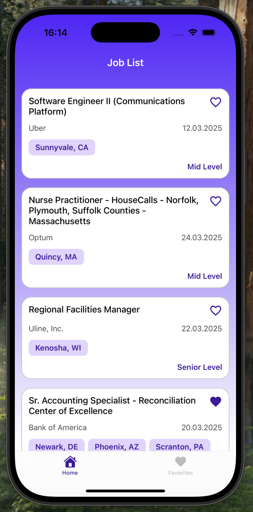
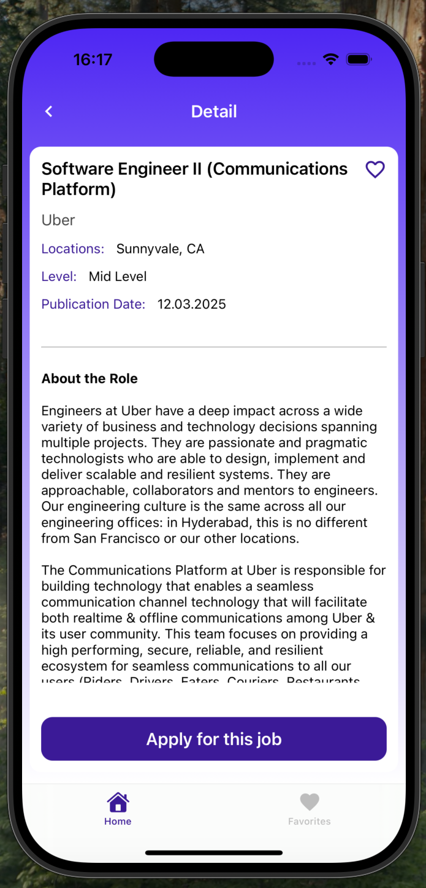
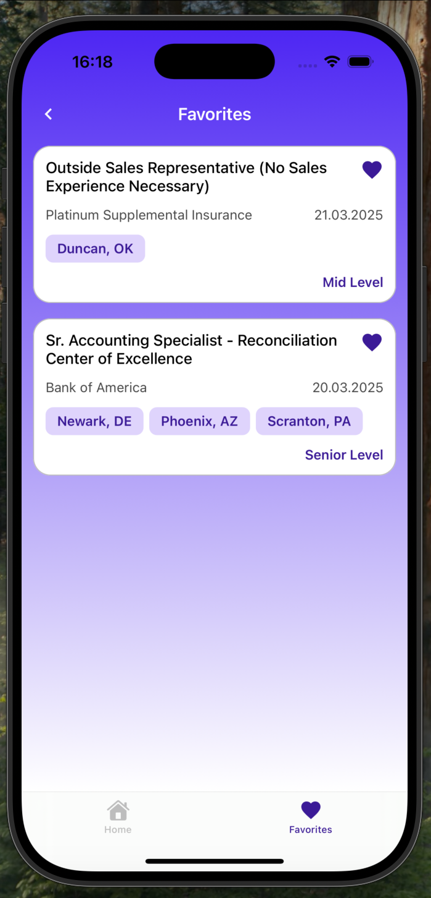

# 💼 JobFinderApp

Bu proje, React Native öğrenme sürecimin dördüncü aşaması olarak geliştirilmiştir. JobFinderApp, kullanıcıların iş ilanlarını keşfedebileceği, ilan detaylarına ulaşabileceği ve favori işlerini kaydedebileceği bir mobil uygulamadır. Bu aşamada, Redux Toolkit, asenkron veri yönetimi, dinamik sayfa yapısı ve UI bileşenlerinin özelleştirilmesi gibi konulara odaklanıldı.

## 🚀 Kullanılan Teknolojiler

React Native → Uygulamanın frontend kısmı için kullanıldı.

Redux Toolkit → Global state yönetimi ve favorilere ekleme/silme işlemleri için kullanıldı.

React Native Async Storage & Redux Persist → Kullanıcı verilerinin (favori iş ilanları vb.) kayıtlı kalması sağlandı.

Expo Router → Dinamik sayfa yapısı oluşturmak ve sayfa yönlendirmeleri yapmak için kullanıldı.

Axios → API ile veri alışverişi yapmak için kullanıldı.

Custom Hook → API isteklerini yönetmek ve kod tekrarını azaltmak için özel hook'lar oluşturuldu.

React Native HTMLView → API'den gelen HTML içeriğin düzenli şekilde görüntülenmesi sağlandı.

Expo Linear Gradient → Arayüzde gradient arkaplan kullanımı sağlandı.

Expo Vector Icons → Uygulama içerisinde ikon kullanımı için tercih edildi.

Pagination Yapısı → Sayfa kaydırıldıkça yeni verilerin API'den getirilmesi sağlandı.

Alert Yapısı → Favorilere ekleme ve çıkarma gibi işlemlerde geri bildirim vermek için kullanıldı.

## Üzerinde Durulan Konular

### 🔹 Redux Toolkit ile State Yönetimi

Global state yönetimi Redux Toolkit ile sağlandı.

Favorilere ekleme ve çıkarma işlemleri Redux store üzerinden yönetildi.

Redux Persist ve Async Storage entegrasyonu ile favori iş ilanlarının uygulama kapanıp açıldığında korunması sağlandı.

### 🔹 API Entegrasyonu & Axios

Axios kullanılarak API işlemleri gerçekleştirildi.

API verileri pagination destekleyecek şekilde hook yapısına uygun olarak yönetildi.

Veri çekme, hata yönetimi ve loading durumu için custom hook'lar oluşturuldu.

### 🔹 Dinamik Sayfa Yapısı & Expo Router

Expo Router'ın dinamik sayfa yapısı kullanılarak detay sayfaları id parametresi ile oluşturuldu.

Özelleştirilmiş geri düğmesi ve sayfa başlıkları kullanıldı

### 🔹 UI/UX Geliştirmeleri

Custom Header ve Back Button → Default başlık ve geri butonları yerine özelleştirilmiş bileşenler kullanıldı.

React Native HTMLView → API'den gelen iş ilanı detayları HTML formatında olduğu için HTMLView paketi ile düzenli görüntülenmesi sağlandı.

Expo Linear Gradient → Arayüzde gradient arkaplan ile daha modern bir tasarım elde edildi.

Pagination Desteği → Sayfa kaydırıldıkça yeni ilanlar getirilerek sonsuz kaydırma yapısı sağlandı.

### 🔹 Kullanıcı Deneyimi ve Bildirimler

Favorilere ekleme/çıkarma işlemlerinde Alert Kullanımı → Kullanıcıya geri bildirim vermek için alert mesajları kullanıldı.

Loading & Error Yönetimi → Veri çekme süresince loading gösterildi, hata durumları için uygun mesajlar sunuldu.

##### 📷 Ekran Görüntüleri

https://github.com/user-attachments/assets/ee091434-1553-4e47-a4d9-d7e282d3ae0f

